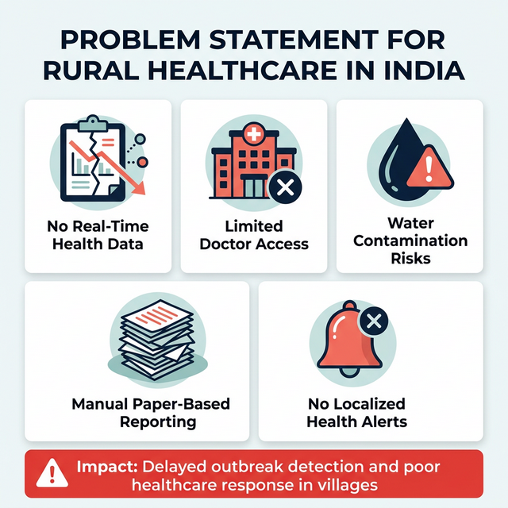
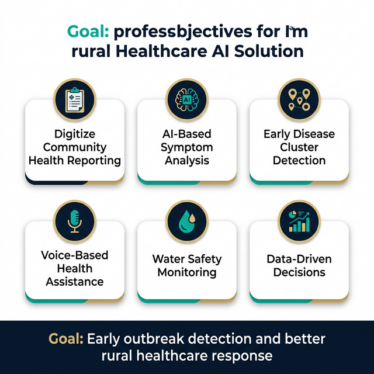
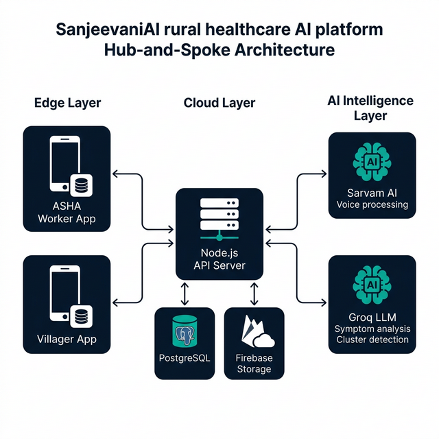
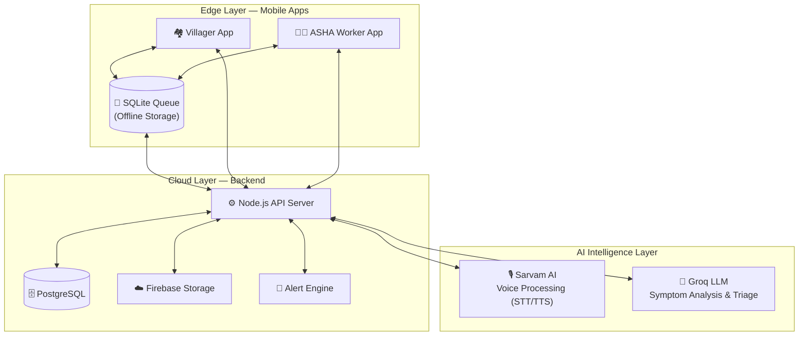
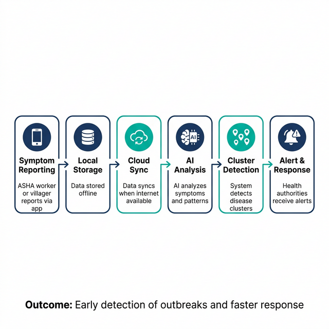
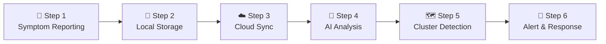
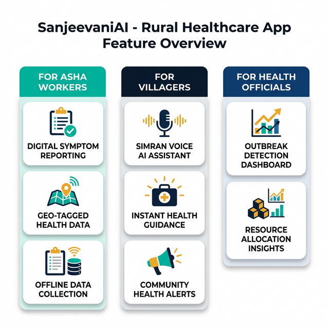
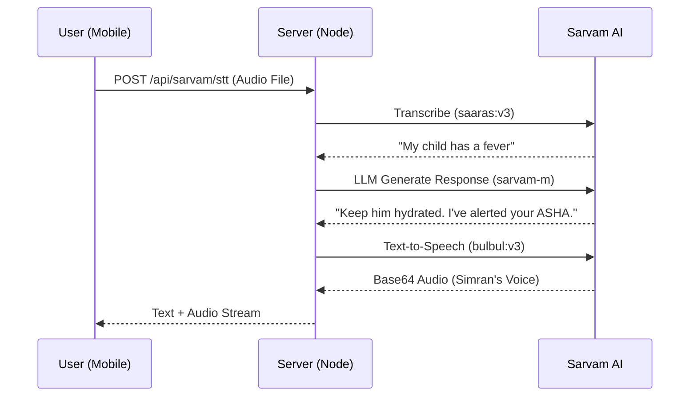
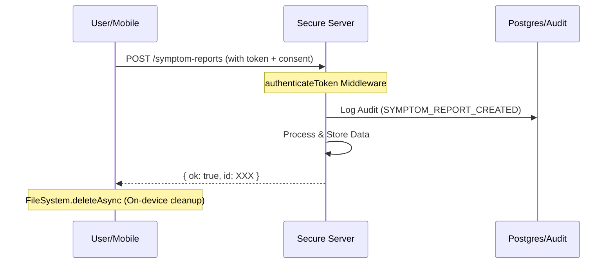
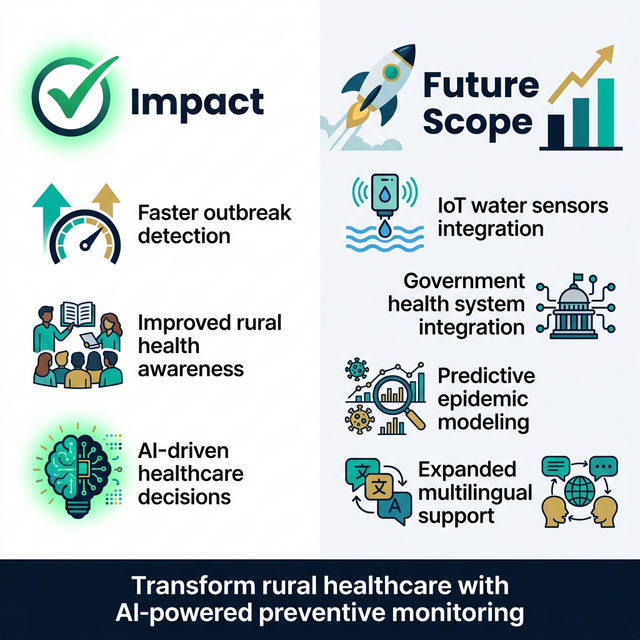

# Product Requirements Document (PRD)
# SanjeevaniAI — Smart Community Health

---

## 1. Executive Summary

**SanjeevaniAI** is a comprehensive, AI-powered digital health ecosystem designed for rural and tribal communities in India. The platform bridges the gap between villagers ("Localites"), frontline community health workers ("ASHA"), and formal healthcare facilities ("Clinics") to enable proactive disease surveillance, water quality monitoring, and immediate health assistance.

The system is specifically tailored for the **North East India** context and works even in **low or no internet environments**, ensuring that remote communities are never left behind.

---

## 2. Problem Statement

Rural and tribal communities in India face critical healthcare challenges that lead to delayed outbreak detection and poor healthcare response in villages.

### Core Challenges

| # | Challenge | Description |
|---|-----------|-------------|
| 1 | **No Real-Time Health Data** | Lack of real-time health data for disease monitoring makes it impossible to track outbreaks as they emerge. |
| 2 | **Limited Doctor Access** | Severe shortage of doctors and healthcare infrastructure in remote areas leaves villagers without medical care. |
| 3 | **Water Contamination Risks** | Contaminated water sources lead to waterborne diseases such as cholera, typhoid, and diarrhea. |
| 4 | **Manual Paper-Based Reporting** | ASHA workers rely on manual paper-based reporting, causing data loss, delays, and inaccuracies. |
| 5 | **No Localized Alerts** | Lack of localized health awareness and alerts means communities are uninformed about nearby outbreaks. |

> [!CAUTION]
> **Impact:** Delayed outbreak detection and poor healthcare response in villages — directly affecting millions of lives in underserved communities.

---

## 3. Objective of Our Solution

SanjeevaniAI aims to transform rural healthcare by addressing each of the core challenges through intelligent technology.

### Key Objectives

1. **Digitize Community Health Reporting** — Replace paper-based workflows with digital symptom and water quality reporting.
2. **AI-Based Symptom Analysis** — Provide instant health guidance using AI-powered triage and analysis.
3. **Early Disease Cluster Detection** — Detect emerging outbreaks by analyzing geo-tagged symptom patterns across villages.
4. **Voice-Based Health Assistance** — Enable villagers to interact with the system using voice in their local language (via Simran AI).
5. **Water Safety Monitoring** — Track water quality parameters (pH, turbidity, H₂S, chlorine, nitrate) to prevent waterborne diseases.
6. **Data-Driven Decisions** — Empower health officials with dashboards and insights for resource allocation and response planning.

> [!IMPORTANT]
> **Goal:** Early outbreak detection and better rural healthcare response through AI-powered digital infrastructure.

---

## 4. Solution Overview

SanjeevaniAI is an **AI-powered digital health ecosystem** that follows a **Hub-and-Spoke Architecture** across three layers:

| Layer | Role | Components |
|-------|------|------------|
| **Edge Layer** | Primary data collection at the village level | Mobile app for ASHA workers & villagers, local SQLite storage (offline queue) |
| **Cloud Layer** | Central backend handling health data | Node.js API server, PostgreSQL health database, Firebase for media |
| **AI Intelligence Layer** | AI models for analysis and insights | Sarvam AI (voice processing), Groq/LLM (symptom analysis & cluster detection) |

> [!NOTE]
> The system works even in **low or no internet environments**. Data is stored locally on the device and automatically syncs when connectivity is restored.

---

## 5. System Architecture

SanjeevaniAI follows a hub-and-spoke model where the Mobile App (Edge) acts as the primary data collector, syncing to a Central Server (Cloud) which orchestrates AI and Analytics.

### 5.1. Architecture Components

### 5.2. Component Breakdown

| Component | Technology | Purpose |
|-----------|-----------|---------|
| ASHA Worker App | React Native (Expo) | Digital symptom reporting, water testing, offline data collection |
| Villager App | React Native (Expo) | Voice AI assistant, health guidance, community alerts |
| SQLite Queue | expo-sqlite | Offline data persistence and auto-sync queue |
| API Server | Express.js | Authentication, data validation, AI orchestration |
| Health Database | PostgreSQL | Central source of truth for all health and environmental data |
| Media Storage | Firebase | Audio files and image uploads |
| Alert Engine | Background Worker | Cluster detection, outbreak alerts, notifications |
| Voice AI (Simran) | Sarvam AI (saaras:v3, sarvam-m, bulbul:v3) | Multilingual STT, conversational AI, TTS |
| Symptom Analysis | Groq (Llama-3) | AI-powered symptom triage and cluster detection |

---

## 6. Workflow / Pipeline

The system follows a streamlined 6-step pipeline from data collection to actionable alerts.

### Step-by-Step Flow

| Step | Action | Detail |
|------|--------|--------|
| **Step 1** | Symptom Reporting | ASHA worker or villager reports symptoms via the mobile app |
| **Step 2** | Local Storage | Data is stored locally in SQLite (offline support) |
| **Step 3** | Cloud Sync | Data syncs to cloud when internet connectivity is available |
| **Step 4** | AI Analysis | AI engine analyzes symptoms and detects patterns |
| **Step 5** | Cluster Detection | System detects possible disease clusters based on geo-tagged data |
| **Step 6** | Alert & Response | Health authorities receive alerts and actionable insights |

> [!TIP]
> **Outcome:** Early detection of outbreaks and faster response — reducing the time from symptom appearance to coordinated public health action.

---

## 7. Key Features

SanjeevaniAI provides tailored features for three distinct user roles.

### 7.1. For ASHA Workers

| Feature | Description |
|---------|-------------|
| **Digital Symptom Reporting** | Replace paper logbooks with validated digital symptom entry |
| **Geo-Tagged Health Data** | Automatically attach GPS coordinates to every health report |
| **Offline Data Collection** | Full functionality in zero-connectivity zones with auto-sync |
| **Water Quality Testing** | Digital entry for pH, turbidity, H₂S, chlorine, and nitrate metrics |
| **Cluster Dashboard** | View emerging outbreak zones highlighted on village maps |

### 7.2. For Villagers (Localites)

| Feature | Description |
|---------|-------------|
| **Simran Voice AI Assistant** | Interact using voice in local languages for health guidance |
| **Instant Health Guidance** | AI-generated 3–5 immediate care tips while waiting for ASHA |
| **Community Health Alerts** | Receive localized alerts about water safety and disease outbreaks |
| **Chat History** | Simran remembers previous interactions for continuity of care |

### 7.3. For Health Officials

| Feature | Description |
|---------|-------------|
| **Outbreak Detection Dashboard** | Visualize disease clusters across villages in real-time |
| **Resource Allocation Insights** | Data-driven recommendations for deploying medical resources |
| **Alert Management** | Review and respond to automated cluster and water quality alerts |

---

## 8. Detailed Workflows

### 8.1. The Digital Water Safety Workflow

1. **Test**: ASHA worker performs a field chemical test.
2. **Entry**: Data entered into the **WaterTestReportScreen**.
3. **Propagation**:
    - If Turbidity > threshold or H₂S is "Unsafe", the system generates an `alert`.
    - Village dashboard for Localites updates immediately upon server sync.

### 8.2. Voice Health Assistant (Simran)

### 8.3. Offline Synchronization Workflow

- **Check**: App uses `NetInfo` to detect connectivity.
- **Queue**: If offline, data is persisted to SQLite with a `pending` status.
- **Auto-Sync**: Upon re-connection, a background process loops through the queue:
    - Extracts payload → Hits API → Removes from SQLite on success.

### 8.4. Infection Cluster Detection

If village **X** reports **>5 cases** of fever within **72 hours**, the alert engine highlights village X on the ASHA dashboard as an **"Emerging Outbreak Zone"** and notifies health officials.

---

## 9. Database Schema

### 9.1. Central Database (PostgreSQL)

The core source of truth for all health and environmental data.

| Table | Purpose | Key Columns |
| :--- | :--- | :--- |
| `users` | Auth & Profiles | `id, name, email, village, role (Localite/ASHA/Clinic)` |
| `symptom_reports` | Public Health Data | `village, symptoms (JSONB/Array), location (GIS), photo_url` |
| `water_tests` | Environmental Quality | `source_type, ph, turbidity, h2s_result, chlorine, nitrate` |
| `alerts` | Notification Hub | `title, type (Cluster/Water), risk (High/Med), village` |
| `assistance_requests`| Citizen Help Desk | `description, audio_url, status (Pending/Resolved), solutions (AI)` |
| `sarvam_chats` | AI Interaction Log | `user_id, role (User/Assistant), content, timestamp` |
| `audit_logs` | Security Audit Trail | `user_id, action, resource_id, resource_type, timestamp` |
| `user_consents` | Consent Registry | `user_id, purpose, consent_given, ip_address, timestamp` |

### 9.2. Mobile Cache (SQLite)

Used for data integrity in zero-connectivity zones.

- **Table `queue`**: Stores `id, type (WATER_TEST/SYMPTOM), payload (JSON), status`.
- **Table `alerts`**: Local cache of latest notifications for offline reading.

---

## 10. Technical Stack

| Layer | Technology | Purpose |
|-------|-----------|---------|
| **Frontend** | React Native (Expo) | Cross-platform mobile app |
| **UI Framework** | react-native-paper | Material Design components |
| **Audio** | expo-av | Voice recording and playback |
| **Local Storage** | expo-sqlite | Offline data queue |
| **Secure Storage** | expo-secure-store | Hardware-backed token encryption |
| **Backend** | Express.js (Node.js) | REST API server |
| **Database** | PostgreSQL (`pg` client) | Central health database |
| **Media Storage** | Firebase | Cloud storage for audio/images |
| **Voice AI** | Sarvam AI SDK | Multilingual STT, LLM, TTS |
| **Symptom AI** | Groq (Llama-3) | Symptom triage and analysis |
| **Internationalization** | i18n | Multilingual interface support |

---

## 11. Data Privacy & Security (DPDP Compliance)

To comply with India's **Digital Personal Data Protection (DPDP) Act**, the system implements the following safeguards:

### 11.1. Consent & Purpose Limitation

- **Explicit Consent**: All data collection screens (Symptoms, Water Tests) require an explicit user consent toggle.
- **Consent Registry**: Every instance of consent is logged in the `user_consents` table with a timestamp and IP address for auditability.

### 11.2. Data Minimization & Secure Auth

- **JWT Authentication**: Signed JSON Web Tokens with minimized claims (`uid` and `role` only) to prevent health data leakage in session tokens.
- **Secure File Serving**: The `/uploads` directory is no longer publicly accessible. Files are served through an authenticated proxy route (`/files/:filename`) that verifies JWTs.

### 11.3. Retention & Deletion Logic

- **Automated Anonymization**: A background worker anonymizes symptom reports older than **180 days** and purges old audit logs older than **365 days**.
- **Right to Erasure**: A dedicated `/api/user/delete-data` endpoint allows users to request full deletion of their account, chats, and personal identifiers.

### 11.4. On-Device Privacy

- **Secure Token Storage**: Uses `expo-secure-store` for hardware-backed encryption of authentication tokens on the mobile device.
- **Media Cleanup**: Temporary audio files used for transcription are automatically deleted from the device immediately after successful upload.

### 11.5. Privacy Data Flow

---

## 12. Impact & Future Scope

### 12.1. Impact

| Area | Outcome |
|------|---------|
| **Outbreak Detection** | Faster identification of disease clusters through real-time geo-tagged data and AI analysis |
| **Rural Health Awareness** | Improved health literacy via voice-based AI assistant (Simran) in local languages |
| **Healthcare Decisions** | Data-driven decision making for resource allocation and emergency response |
| **ASHA Empowerment** | Digital tools replace paper-based workflows, improving accuracy and efficiency |
| **Water Safety** | Continuous monitoring prevents waterborne disease outbreaks |

### 12.2. Future Enhancements

| Enhancement | Description |
|-------------|-------------|
| **IoT Water Sensors** | Automated real-time water quality monitoring at community water sources |
| **Government Integration** | Direct integration with India's national health information systems (IDSP, IHIP) |
| **Predictive Epidemic Modeling** | AI models that forecast disease spread based on historical and environmental data |
| **Expanded Multilingual Support** | Coverage for additional regional languages and dialects |
| **Telemedicine Integration** | Video consultations connecting villagers directly with urban specialists |

> [!IMPORTANT]
> **Vision:** Transform rural healthcare with AI-powered preventive monitoring — making every village health-visible and every outbreak detectable before it becomes an epidemic.

---

*SanjeevaniAI — Bringing AI-powered healthcare to every village in India.* 🏥🌿
